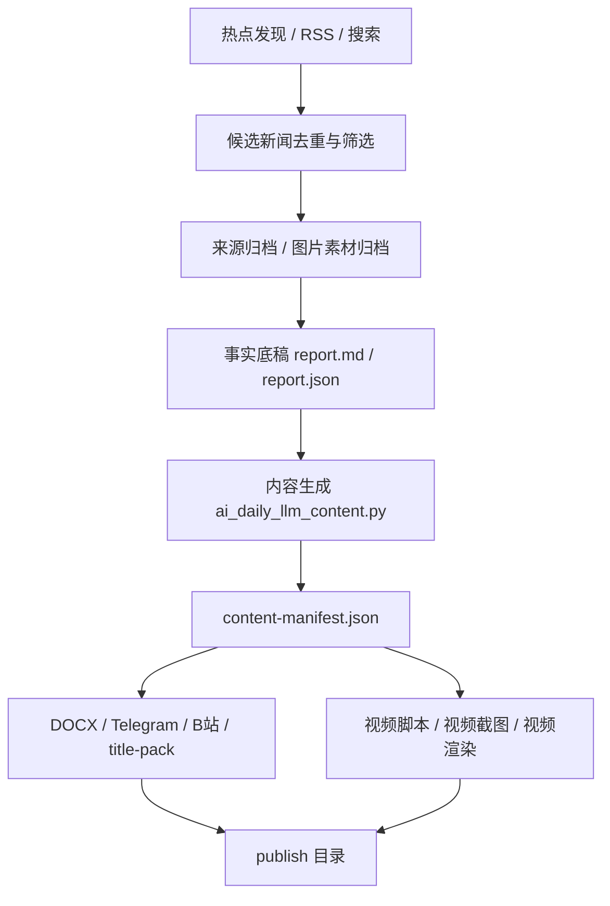
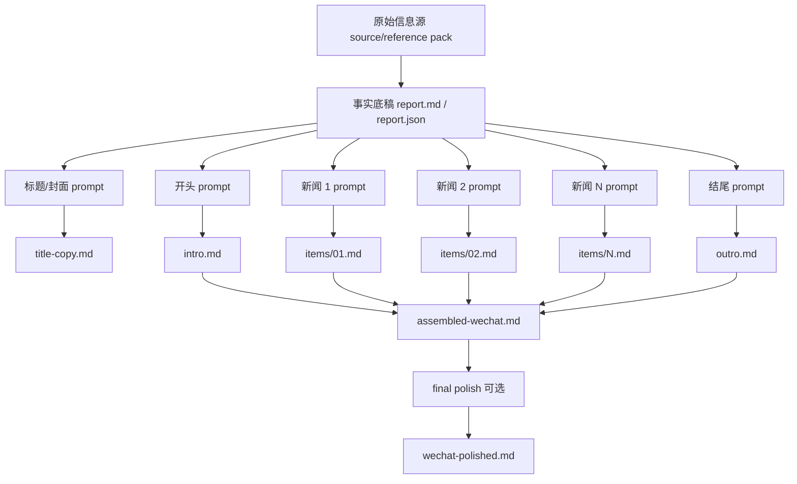

# AI 日报报告生成系统分析文档

版本：2026-04-24  
状态：供人工 Review 使用  
范围：事实收集、事实底稿、公众号内容生成、标题/封面/发布文案生成、DOCX 渲染的系统分析与改造设计  
明确不做：本文件不触发 Gemini/OpenClaw 内容调用，不重新生成 DOCX、视频、截图或发布包

## 1. 背景

当前 AI 日报流程已经覆盖从热点发现、事实收集、候选筛选、事实底稿、公众号 DOCX、标题封面、平台文案到视频截图/视频的完整链路。

但内容质量问题反复出现，核心原因不是单个 prompt 写得不够长，而是系统里混入了太多内容层规则：

- Python 代码承担了标题实体判断、模板短语检查、抽象主语判断、口播数字读法等本应交给模型或编辑 prompt 的工作。
- 内容生成曾经尝试过 schema 驱动，导致模型像填字段，而不是像主编写文章。
- 公众号正文虽然改为 Markdown，但仍由脚本拆分、校验、重试，容易形成模板化结构。
- 最终润色没有稳定地把原始信息源、事实底稿和每段上下文分别给到模型，导致文章看起来像摘要拼接。

新的方向是：

> 脚本负责事实、文件、链接、图片、格式和渲染；模型负责内容表达、标题判断、段落润色和编辑声音。

## 2. 参考对象与写作逻辑

### 2.1 主要参考对象：机器之心

本轮联网检索后，建议主要参考「机器之心」的内容逻辑，而不是更偏流量化的 AI 自媒体。

公开资料显示，机器之心长期定位为 AI 垂直科技媒体，内容覆盖 AI 新闻、研究论文、产业动态、技术解读、算法实现、企业/学者访谈等。其官网也将入口拆为文章库、PRO 通讯、SOTA 模型、AI Shortlist 等。

参考链接：

- https://www.jiqizhixin.com/
- https://pro.jiqizhixin.com/
- https://www.cnmo.com/baina/articles/430085.html
- https://www.meoai.net/sites/12019.html

总结出的写作逻辑：

1. 标题先出现具体对象：公司、模型、论文、产品、榜单、评测体系，而不是抽象行业判断。
2. 开头先回答「为什么现在重要」，不要日报式寒暄和报菜名。
3. 正文先给事实锚点，再解释技术、产品或产业含义。
4. 多条新闻要被收束到一个技术趋势或产业判断，而不是孤立罗列。
5. 专业性来自具体信息密度，不来自堆术语。
6. 排版要服务扫读，小标题、加粗、图片、引用都要承担信息层级。

### 2.2 公众号传播方法论补充

参考虎嗅转载的公众号写作方法论，可以抽象为：

- 标题和首屏要快速建立点击理由。
- 开头要有真实场景、反常识观察或明确痛点。
- 中段要给具体价值，不要空泛说理。
- 排版是阅读体验设计，不是装饰。
- AI 只能提效，最终判断和细节需要编辑注入。

参考链接：

- https://www.huxiu.com/article/4832683.html

对 AI 日报的落地要求：

- 开头不写栏目说明，要从当天真正变化切入。
- 每条新闻不只解释「发生了什么」，还要解释「这对工作流、成本、入口、平台控制权意味着什么」。
- 结尾不是固定栏目，而是把当天主线收成一个判断。

## 3. 当前系统流程



当前问题主要集中在 E：

- E 既负责 prompt，又负责内容结构，又负责部分内容校验。
- 内容判断和表达规则散落在函数里，不利于人工审查。
- 一些规则应迁移到完整 prompt，或彻底删除。

## 4. 代码文件清单

### 4.1 总调度

| 文件 | 职责 | Review 重点 |
| --- | --- | --- |
| `/Users/dystopia/.openclaw/workspace/scripts/run_tech_daily_pipeline.py` | 每日流水线总入口 | 是否把文字、DOCX、视频、发布包耦合过紧；是否允许只生成文字稿 |
| `/Users/dystopia/.openclaw/workspace/scripts/ai_daily_paths.py` | 日期目录和产物路径 | 路径是否清晰；是否存在旧路径优先级误用 |
| `/Users/dystopia/.openclaw/workspace/scripts/finalize_tech_daily_collection.py` | 汇总收集结果并落入 final | 是否可能拿旧 report；是否有隐式 fallback |

### 4.2 热点发现与事实收集

| 文件 | 职责 | Review 重点 |
| --- | --- | --- |
| `/Users/dystopia/.openclaw/workspace/scripts/tech_daily_prepare_discovery.py` | 准备发现任务 | 24 小时热点窗口是否稳定 |
| `/Users/dystopia/.openclaw/workspace/scripts/tech_daily_rsshub_discovery.py` | RSSHub / feed 候选发现 | 数据源覆盖、时间过滤、去重前字段 |
| `/Users/dystopia/.openclaw/workspace/scripts/tech_daily_feed_healthcheck.py` | feed 健康检查 | 失败时是否影响主流程 |
| `/Users/dystopia/.openclaw/workspace/scripts/tech_daily_search_terms.py` | 搜索词辅助 | 是否有旧主题硬编码 |
| `/Users/dystopia/.openclaw/workspace/scripts/tech_daily_candidate_review.py` | 候选筛选、去重、排序 | 是否在代码里写死内容偏好 |
| `/Users/dystopia/.openclaw/workspace/scripts/archive_reference_sources.py` | 归档参考来源 | URL、正文、图片是否可追溯 |
| `/Users/dystopia/.openclaw/workspace/scripts/archive_social_sources.py` | 归档社交来源 | X/网页/公众号来源是否稳定 |
| `/Users/dystopia/.openclaw/workspace/scripts/tech_daily_media_resolver.py` | 图片素材选择 | 是否优先真实图片，截图只兜底 |

### 4.3 事实底稿

| 文件 | 职责 | Review 重点 |
| --- | --- | --- |
| `/Users/dystopia/.openclaw/workspace/scripts/tech_daily_text_compile.py` | 编译事实报告 | 是否只做事实整理，不做风格写作 |
| `/Users/dystopia/.openclaw/workspace/scripts/tech-daily-text-compile` | CLI 包装入口 | 参数是否清晰 |
| `/Users/dystopia/.openclaw/workspace/scripts/tech_daily_parser.py` | 解析 report.md / report.json | 是否保留原始事实字段 |
| `/Users/dystopia/.openclaw/workspace/scripts/tech_daily_writer_layer.py` | 旧写作层 | 重点检查是否仍残留内容硬编码；建议逐步废弃或只保留事实格式化 |

### 4.4 内容生成核心

| 文件 | 职责 | Review 重点 |
| --- | --- | --- |
| `/Users/dystopia/.openclaw/workspace/scripts/ai_daily_llm_content.py` | 当前 Markdown-first 内容生成核心 | 是否只保留 prompt 组装、模型调用、文件落盘；删除内容判断函数 |
| `/Users/dystopia/.openclaw/workspace/scripts/build_tech_daily_style_corpus.py` | 风格样本构建 | 是否只输出风格说明，不泄露原文 |
| `/Users/dystopia/.openclaw/workspace/scripts/learn_tech_daily_writing_playbook.py` | 写作 playbook 学习 | 是否能吸收参考逻辑，而不是变成硬模板 |

### 4.5 DOCX / 发布包

| 文件 | 职责 | Review 重点 |
| --- | --- | --- |
| `/Users/dystopia/.openclaw/workspace/scripts/wechat_docx_builder.py` | 微信 DOCX 渲染 | 只负责 Markdown、图片、链接、加粗、排版 |
| `/Users/dystopia/.openclaw/workspace/skills/daily-multi-platform-publisher/scripts/render_publish_bundle.py` | 渲染发布包 | 不应生成正文句子，只读内容源 |
| `/Users/dystopia/.openclaw/workspace/scripts/tech-daily-publish-bundle` | 发布包 CLI | 参数和输入文件是否清晰 |
| `/Users/dystopia/.openclaw/workspace/scripts/generate_tech_daily_title_pack.py` | 标题包物化 | 只做读取和长度硬门槛，不改写标题 |
| `/Users/dystopia/.openclaw/workspace/scripts/generate_tech_daily_cover_copy.py` | 封面文案物化 | 只做读取和显示约束，不生成内容 |
| `/Users/dystopia/.openclaw/workspace/scripts/tech_daily_cover_resolver.py` | 封面图解析 | 不应决定封面文字 |

### 4.6 图片 / 封面

| 文件 | 职责 | Review 重点 |
| --- | --- | --- |
| `/Users/dystopia/.openclaw/workspace/skills/plus-media-factory/scripts/fetch_story_images.py` | 抓取新闻相关图片 | 真实图片优先 |
| `/Users/dystopia/.openclaw/workspace/skills/plus-media-factory/scripts/assemble_story_collage.swift` | 拼新闻图 | 是否只做视觉合成 |
| `/Users/dystopia/.openclaw/workspace/skills/plus-media-factory/scripts/assemble_magazine_cover.swift` | 生成封面视觉 | 不应改写文案 |
| `/Users/dystopia/.openclaw/workspace/skills/plus-media-factory/scripts/chatgpt_cover_browser.py` | 浏览器生成封面 | 是否仍需要 |
| `/Users/dystopia/.openclaw/workspace/skills/plus-media-factory/scripts/gemini_cover_browser.py` | 浏览器生成封面 | 与 Gemini API 文字润色无关，避免混用 |
| `/Users/dystopia/.openclaw/workspace/skills/plus-media-factory/scripts/cover_browser_router.py` | 封面生成路由 | 是否存在不透明 fallback |

### 4.7 质量检查

| 文件 | 职责 | Review 重点 |
| --- | --- | --- |
| `/Users/dystopia/.openclaw/workspace/scripts/audit_tech_daily_artifacts.py` | 产物审计 | 应检查事实/文件/链接，不检查文风禁词 |
| `/Users/dystopia/.openclaw/workspace/scripts/test_ai_daily_contracts.py` | 合约测试 | 删除内容表达硬编码测试，仅保留结构和事实边界 |
| `/Users/dystopia/.openclaw/workspace/scripts/review_daily_cover.swift` | 封面视觉审查 | 检查文字是否显示完整 |

### 4.8 视频相关

本次文字稿改造先不动视频，但日报总流程会碰到：

| 文件 | 职责 |
| --- | --- |
| `/Users/dystopia/.openclaw/workspace/scripts/tech-daily-video-build` | 视频构建 CLI |
| `/Users/dystopia/.openclaw/workspace/scripts/generate_tech_daily_video_screenshots.py` | 视频截图包 |
| `/Users/dystopia/.openclaw/workspace/skills/tech-daily-video-factory/scripts/build_tech_daily_video.py` | 视频生成主脚本 |
| `/Users/dystopia/.openclaw/workspace/skills/tech-daily-video-factory/scripts/video_build_script.py` | 视频脚本构建 |
| `/Users/dystopia/.openclaw/workspace/skills/tech-daily-video-factory/remotion/src/DailyReport.tsx` | Remotion 总组件 |
| `/Users/dystopia/.openclaw/workspace/skills/tech-daily-video-factory/remotion/src/IntroScene.tsx` | 开场页 |
| `/Users/dystopia/.openclaw/workspace/skills/tech-daily-video-factory/remotion/src/ItemScene.tsx` | 新闻页 |
| `/Users/dystopia/.openclaw/workspace/skills/tech-daily-video-factory/remotion/src/SegmentedProgressRail.tsx` | 顶部进度条 |
| `/Users/dystopia/.openclaw/workspace/skills/tech-daily-video-factory/remotion/src/TextFit.tsx` | 文本自适应 |

## 5. 目标内容生成方案

### 5.1 核心原则

1. 不使用 schema 驱动正文生成。
2. 不在 Python 里写内容判断规则。
3. 不让脚本拼正文句子。
4. 每个内容部分单独给模型输入相关事实和底稿。
5. 每次调用输出 Markdown 或纯文本片段。
6. 脚本只负责拼接、文件落盘、链接核验、DOCX 渲染。

### 5.2 Gemini 分段优化策略

不要一次把所有内容丢给 Gemini 生成整篇，而是分段调用：



建议产物结构：

```text
final/content/gemini/
  prompt-common.md
  title-prompt.md
  title-copy.md
  intro-prompt.md
  intro.md
  items/
    01-prompt.md
    01.md
    02-prompt.md
    02.md
  outro-prompt.md
  outro.md
  assembled-wechat.md
  wechat-polished.md
```

### 5.3 每段输入内容

#### 标题 / 封面

输入：

- 当天 6 条新闻的标题、实体、核心事实、读者利益点。
- 当天总主线。
- 机器之心式标题逻辑：具体对象 + 真实变化 + 技术/产业含义。
- 平台字数限制。

输出：

- 主传播标题
- 微信标题
- 视频标题
- B站标题
- 封面主标题
- 封面副标题
- 文件名短标题

#### 开头

输入：

- 全部新闻的简短事实摘要。
- 当天最强主线。
- 原始底稿中的开头草稿，如果有。
- 写作逻辑：从真实变化、反常识观察或具体场景切入。

输出：

- 2-3 个自然段。
- 不出现栏目腔。
- 不报菜名。

#### 每条新闻

输入：

- 该新闻的原始来源 URL。
- 来源摘要、引用、发布时间、实体名、数字、版本号。
- 该新闻在事实底稿中的内容和解读。
- 当天其他新闻的一句话上下文，用于保持全篇主线。

输出：

- 小节标题。
- 2-4 个自然段。
- 第一层：发生了什么。
- 第二层：这影响谁、改变什么入口/成本/工作流。
- 第三层：Lumi 的编辑判断。

#### 结尾

输入：

- 六条新闻的小节标题和每条一句判断。
- 当天主线。
- 开头段落。

输出：

- 一个自然拟定的小标题。
- 1-2 段收束。
- 给读者一个可带走的判断。

### 5.4 是否需要最终整篇润色

建议保留一个可选步骤，但只做「语气统一和段落衔接」，不能重写事实。

输入：

- 标题
- 开头
- N 条新闻正文
- 结尾
- 来源链接

输出：

- `wechat-polished.md`

限制：

- 不新增事实。
- 不删 URL。
- 不改数字。
- 不改实体名。
- 不改变每条新闻顺序。

## 6. Prompt 设计方案

### 6.1 通用系统 Prompt

```markdown
你是 Lumi 的 AI 日报主编。你不是摘要机器人，也不是营销号写手。

你的任务是把输入的事实材料写成可以发布的中文 AI 公众号内容。

写作对象：
熟悉 AI 产品、模型、Agent、开发者工具、算力成本和产业变化的中文读者。

写作声音：
专业、可信、轻快、有判断、有一点温度。不要夸张，不要报告腔，不要套话。

内容原则：
1. 只使用输入材料里的事实、数字、日期、版本号、公司名、模型名和 URL。
2. 不新增未经提供的信息。
3. 通俗不是口水化，而是把复杂变化放进具体场景里讲清楚。
4. 每段都要有事实锚点或编辑判断，不能空泛。
5. 参考机器之心的专业信息密度和技术解释方式，但最终声音属于 Lumi。
6. 不输出 JSON，不输出代码块，不解释写作过程。
```

### 6.2 标题 Prompt

```markdown
基于下面的事实底稿和来源摘要，生成今天 AI 日报的标题与封面文案。

目标：
标题必须让读者一眼知道今天最值得看的具体变化是什么。

标题逻辑：
- 具体实体优先：公司、模型、产品、论文、工具或平台。
- 真实变化优先：发布、开源、降价、接入、事故复盘、能力跃迁、入口变化。
- 读者利益优先：成本、工作流、开发方式、平台控制权、默认选择。

不要写抽象主题标题。
不要只写“AI 行业变了”“模型更强了”。

输入材料：
{{global_fact_brief}}

输出：
主传播标题：
微信标题：
视频标题：
B站标题：
封面主标题：
封面副标题：
文件名短标题：
```

### 6.3 开头 Prompt

```markdown
请写今天 AI 日报的公众号开头。

输入：
{{global_fact_brief}}
{{draft_intro_if_any}}

写作要求：
从当天最真实的变化、反常识观察或具体使用场景切入。
不要寒暄，不要栏目介绍，不要报菜名。
第二段自然交代今天几条新闻共同说明了什么。

输出：
只输出 2-3 段 Markdown 正文。
```

### 6.4 单条新闻 Prompt

```markdown
请把下面这一条新闻写成公众号正文小节。

全篇主线：
{{daily_thesis}}

当前新闻事实：
{{item_fact_pack}}

原始来源摘要：
{{source_pack_excerpt}}

底稿中的原文：
{{draft_item_text}}

写作要求：
1. 小节标题要有具体实体和具体变化。
2. 第一段讲清发生了什么。
3. 第二段讲这会影响谁，改变什么入口、成本、平台位置或工作流。
4. 第三段给 Lumi 的编辑判断。
5. 不要写成公告翻译。
6. 不要使用固定栏目词。

输出：
## 小节标题

正文段落。
```

### 6.5 结尾 Prompt

```markdown
请写今天 AI 日报的结尾。

输入：
开头：
{{intro}}

每条新闻判断：
{{item_judgements}}

全篇主线：
{{daily_thesis}}

写作要求：
结尾不是总结列表，也不是口号。
请把今天的多条新闻收束成一个读者可以带走的判断。
最好落到接下来应该观察什么、重新计算什么、或工作流会怎样变化。

输出：
## 一个自然的小标题

1-2 段正文。
```

## 7. 代码改造建议

### 7.1 新增文件

建议新增：

`/Users/dystopia/.openclaw/workspace/scripts/ai_daily_gemini_polish.py`

职责：

- 读取 `report.md`、`report.json`、source/reference pack、当前底稿。
- 组装通用 prompt。
- 分段调用 Gemini。
- 输出 Markdown 片段。
- 拼接成 `wechat-polished.md`。

注意：

- Gemini 模型名、API base、temperature、timeout 全部从环境变量或配置文件读取。
- 不在代码里写具体新闻实体。
- 不在代码里写内容禁词表。
- 不做 schema 输出。

### 7.2 收敛 `ai_daily_llm_content.py`

目标职责：

- 读取事实输入。
- 调用内容生成器。
- 构建内部 manifest。
- 做 URL 和文件存在校验。

应移除：

- 标题实体硬拆规则。
- 抽象主语词表。
- 模板标题词表。
- 早晚问候检查。
- 内容质量禁词检查。

可保留：

- URL 提取。
- TTS tag 技术解析。
- Markdown 文件读取。
- 内容 manifest 构建。
- 文件路径和结构校验。

### 7.3 DOCX 渲染保持简单

`wechat_docx_builder.py` 不应理解文章内容，只应负责：

- Markdown 标题层级。
- 段落。
- 加粗。
- 链接。
- 图片插入。
- 样式。

### 7.4 发布包只读内容源

`render_publish_bundle.py` 不生成平台文案句子，只读取：

- `wechat-polished.md`
- `title-copy.md`
- `platform-copy.md`
- 图片 manifest
- source URLs

## 8. 文件产物流

建议最终稳定为：

```text
final/
  report.md
  report.json
  editorial-brief.json
  content/
    title-copy.md
    wechat/
      intro.md
      items/
        01.md
        02.md
        ...
      outro.md
      assembled-wechat.md
      wechat-polished.md
    platform-copy.md
    video-screen-copy.md
  content-manifest.json

publish/
  wechat.docx
  telegram.txt
  bilibili.txt
  title-pack.json
```

## 9. 验收标准

### 9.1 内容层

- 标题有具体实体。
- 开头不是日报报菜名。
- 每条新闻有事实、场景和判断。
- 结尾自然收束，不是固定栏目。
- 文章读起来像专业 AI 公众号编辑写的，而不是 AI 摘要。

### 9.2 系统层

- 不使用 schema 生成正文。
- 不在 Python 里写具体新闻实体示例。
- 不在 Python 里写内容禁词表。
- 不在 Python 里改写标题和正文。
- 分段产物可追溯。
- 失败时不使用硬编码文案兜底。

### 9.3 文件层

- 每次生成都有 prompt 快照。
- 每段输出都有独立 Markdown 文件。
- DOCX 来自 `wechat-polished.md`。
- 标题包来自 `title-copy.md`。
- 平台文案来自 `platform-copy.md`。

## 10. 待你确认的问题

1. Gemini 分段润色是否新增独立脚本 `ai_daily_gemini_polish.py`，还是直接重构 `ai_daily_llm_content.py`？
2. 是否保留 OpenClaw 作为标题/视频文案生成器，只把公众号润色交给 Gemini？
3. 是否允许最终整篇再润色一次，还是严格只拼接分段结果？
4. 标题、封面、平台文案是否也纳入 Gemini 分段输出？
5. 视频相关内容是否暂时冻结，只改公众号 DOCX 文字稿？

## 11. 建议 Review 顺序

第一轮只看内容链路：

1. `/Users/dystopia/.openclaw/workspace/scripts/ai_daily_llm_content.py`
2. `/Users/dystopia/.openclaw/workspace/scripts/tech_daily_writer_layer.py`
3. `/Users/dystopia/.openclaw/workspace/scripts/tech_daily_text_compile.py`
4. `/Users/dystopia/.openclaw/workspace/scripts/wechat_docx_builder.py`
5. `/Users/dystopia/.openclaw/workspace/skills/daily-multi-platform-publisher/scripts/render_publish_bundle.py`

第二轮再看调度和产物：

1. `/Users/dystopia/.openclaw/workspace/scripts/run_tech_daily_pipeline.py`
2. `/Users/dystopia/.openclaw/workspace/scripts/finalize_tech_daily_collection.py`
3. `/Users/dystopia/.openclaw/workspace/scripts/generate_tech_daily_title_pack.py`
4. `/Users/dystopia/.openclaw/workspace/scripts/generate_tech_daily_cover_copy.py`
5. `/Users/dystopia/.openclaw/workspace/scripts/audit_tech_daily_artifacts.py`

第三轮再看视频：

1. `/Users/dystopia/.openclaw/workspace/scripts/generate_tech_daily_video_screenshots.py`
2. `/Users/dystopia/.openclaw/workspace/skills/tech-daily-video-factory/scripts/build_tech_daily_video.py`
3. `/Users/dystopia/.openclaw/workspace/skills/tech-daily-video-factory/remotion/src/ItemScene.tsx`
4. `/Users/dystopia/.openclaw/workspace/skills/tech-daily-video-factory/remotion/src/SegmentedProgressRail.tsx`

## 12. 下一步建议

在你 Review 完这份文档后，建议按这个顺序实施：

1. 先确认 Gemini 分段输出文件结构。
2. 再写独立 Gemini polish 脚本。
3. 把公众号 DOCX 的来源切到 `wechat-polished.md`。
4. 保持视频/TTS 不动。
5. 用今天的事实底稿只重跑文字稿和 DOCX。

